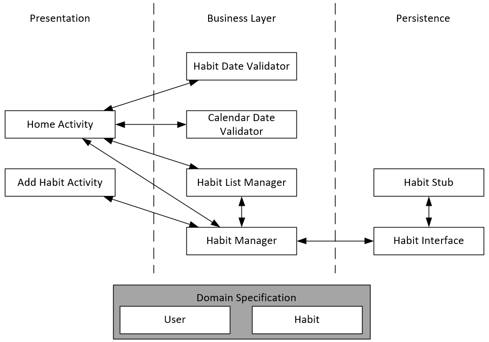

# Architecture:
The Habit Tracker application is designed with a 3-tier architecture. It is split up into 4 java packages: `DomainObjects`, `Presentation`, `Logic`, and `Persistence` (as displayed in the diagram).
# Presentation Layer
Our application has two activities: `HomeActivity` and `AddHabitActivity`. The `HomeActivity` is the home screen of the Habit Tracker, where the calendar is displayed along with a list of habits associated with the selected day. Habits will be displayed in order of the time of day specified.  Users are able to edit and remove habits by long clicking on the habit displayed. The `AddHabitActivity` allows the user to add new habits to the list of current habits. This includes setting the habit name, how many times a week the habit will occur and the time of day each habit is scheduled for. 
# Business Layer
There are six classes associated with the Business Layer of our application: `CalendarDateValidator`, `HabitDateValidator`, `HabitListManager`, `HabitManager`, `NoteManager` and `UserManager`. Both validator classes provide methods that verify that the input given by the presentation layer is correct and properly formatted. The `HabitListManager` manages the list of habits associated with each user. This includes updating the habit in the stub database, and keeping track of habit completion. The `HabitManager` allows habits to be added to the list, removed from the list and updated in the list. The `NoteManager` allows notes to be created for a specific habit, edited and removed from the habit. The `UserManager` allows the user to login, register and change their password.  
# Persistence Layer
The persistence layer has one interface: `HabitsPersistence`. This interface gets the habits associated with a given user, and provides methods for habits to be added, removed or updated in the database. The `HabitStub` class is the stub database implemented in this iteration. It provides an initial list of habits for testing purposes as well as the implementation of all methods defined in the interface.
# Domain Objects
There are two domain objects in this application: `Habit` and `User`. `Habit` represents a single, unique habit. The `User` object represents a unique user. 

